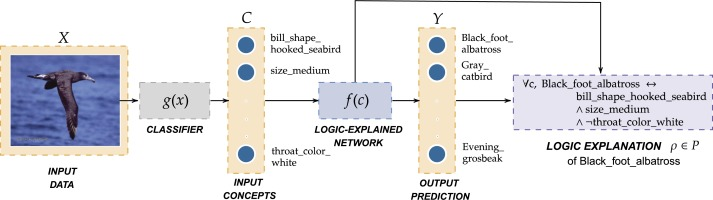
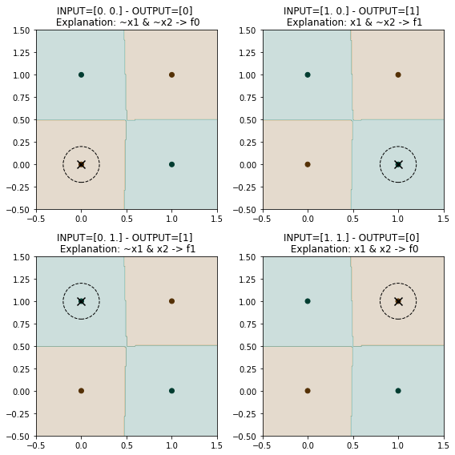

Welcome to the Logic Explained Networks (LENs) repository
=======



Logic Explained Network is a python repository providing a set of utilities and modules to
build deep learning models that are explainable by design.
This library provides both already implemented LENs classes and APIs classes to get First-Order Logic (FOL) explanations from neural networks.
Paper

The idea proposed in this library has been published in the [Logic
Explained
Networks](https://www.sciencedirect.com/science/article/pii/S000437022200162X)
paper, published in the Artificial Intelligence journal.
A publicly available version can be downloaded from
[ArXiv](https://arxiv.org/abs/2108.05149).

Example
=======

### Import LENs

``` {.python}
import lens
import torch
```

### Create train, validation and test datasets

Let's create a XOR-like datasets with 2 redundant features (the 3rd and
4th).

``` {.python}
lens.utils.base.set_seed(0)
x = torch.rand([100, 4])
y = (x[:, 0] > 0.5) & (x[:, 1] < 0.5) | \
    (x[:, 0] < 0.5) & (x[:, 1] > 0.5)

data = torch.utils.data.TensorDataset(x, y)

train_data, val_data, test_data = torch.utils.data.random_split(data, [80, 10, 10])
x_train, y_train = data[train_data.indices]
x_val, y_val = data[val_data.indices]
x_test, y_test = data[test_data.indices]
```

### Instantiate a MuNN 

``` {.python}
model = lens.models.XMuNN(n_classes=2, n_features=4,
                          hidden_neurons=[10], loss=torch.nn.CrossEntropyLoss())
```

### Train the model 
``` {.python}
model.fit(train_data, val_data, epochs=100, l_r=0.1)

## get accuracy on test samples
test_acc = model.evaluate(test_data)
print("Test accuracy:", test_acc)
```

    Epoch: 1/100, Loss: 0.733, Tr_acc: 46.88, Val_acc: 53.00, best_e: -1
    Epoch: 2/100, Loss: 0.733, Tr_acc: 53.12, Val_acc: 53.00, best_e: -1
    Epoch: 3/100, Loss: 0.706, Tr_acc: 53.12, Val_acc: 65.00, best_e: -1
    Epoch: 4/100, Loss: 0.696, Tr_acc: 58.50, Val_acc: 46.00, best_e: -1
    ...
    Epoch: 43/100, Loss: 0.178, Tr_acc: 94.50, Val_acc: 91.00, best_e: -1
    Epoch: 44/100, Loss: 0.169, Tr_acc: 94.12, Val_acc: 92.00, best_e: -1
    Epoch: 45/100, Loss: 0.164, Tr_acc: 94.62, Val_acc: 91.00, best_e: -1
    Epoch: 46/100, Loss: 0.156, Tr_acc: 95.88, Val_acc: 92.00, best_e: -1
    Epoch: 47/100, Loss: 0.149, Tr_acc: 96.00, Val_acc: 92.00, best_e: -1
    Epoch: 48/100, Loss: 0.144, Tr_acc: 97.12, Val_acc: 93.00, best_e: -1
    Epoch: 49/100, Loss: 0.139, Tr_acc: 97.12, Val_acc: 93.00, best_e: -1
    Pruned 2/4 features
    Pruned 2/4 features
    Pruned features
    Epoch: 50/100, Loss: 0.133, Tr_acc: 97.62, Val_acc: 93.00, best_e: -1
    Epoch: 51/100, Loss: 0.140, Tr_acc: 94.62, Val_acc: 78.00, best_e: 51
    Epoch: 52/100, Loss: 0.363, Tr_acc: 81.88, Val_acc: 90.00, best_e: 52
    Epoch: 53/100, Loss: 0.146, Tr_acc: 95.62, Val_acc: 92.00, best_e: 53
    ...
    Epoch: 54/100, Loss: 0.165, Tr_acc: 92.00, Val_acc: 88.00, best_e: 53
    Epoch: 96/100, Loss: 0.099, Tr_acc: 98.12, Val_acc: 98.00, best_e: 89
    Epoch: 97/100, Loss: 0.099, Tr_acc: 98.12, Val_acc: 98.00, best_e: 89
    Epoch: 98/100, Loss: 0.098, Tr_acc: 98.38, Val_acc: 98.00, best_e: 89
    Epoch: 99/100, Loss: 0.097, Tr_acc: 98.88, Val_acc: 97.00, best_e: 89
    Epoch: 100/100, Loss: 0.096, Tr_acc: 98.75, Val_acc: 97.00, best_e: 89
    Test accuracy: 99.0

### Extract and evaluate global explanation

``` {.python}
## get first order logic explanations for a specific target class
target_class = 1
concept_names = ['x1', 'x2', 'x3', 'x4']
formula = model.get_global_explanation(x_train, y_train, target_class,
                                       top_k_explanations=2, concept_names=concept_names)
print(f"{formula} <-> f{target_class}")

## compute explanation accuracy
exp_accuracy, _ = lens.logic.test_explanation(formula, target_class, x_test, y_test,
                                              concept_names=concept_names)
print("Logic Test Accuracy:", exp_accuracy)
```

    (x1 & ~x2) | (x2 & ~x1) <-> f1
    Logic Test Accuracy: 100.0

### Plot decision boundaries and explanations




Structure of the repository 
=============

``` {.}
LENs
├── data
├── examples
│     ├── example.py
|     └── api_examples
├── experiments
├── lens
|     ├── models
│     ├── logic
│         ├── mu_nn
│         ├── psi_nn
│         └── relu_nn
|     └── utils
└── tests
    ├── test_models
    ├── test_logic_base
    └── test_concept_extractors
```
### data
It contains some functions to download and structure the datasets as used in the experiments

### examples
It contains the simple ``xor_example`` reported above, explaining how to train and extract FOL explanations of a LEN.  
Several examples on how to extract explanations from any models are reported in ``api_examples``

### experiments
Here are reported the notebooks used in the paper to test the models. each notebook contains the comparison on one dataset.
Also you can find the exp. against adversarial attacks on cub ``cub_adv.ipynb``, 
the exp. on explaining a black-box models on mimic ``mimic_ebb.ipynb``, and the experiment on interpretable clustering ``mnist_iclu.ipynb``.

### lens.models
The most important folder is of course ``lens.models`` where you can find all the proposed Logic Explained Networks: 
*   The $\psi$ Network 
*   The $\mu$ Network 
*   The ReLu Network. 

These models are explainable by design and they all offer two methods to extract explanations:
*   ``.get_local_explanation()`` which returns the local explanation for one sample prediction
*   ``.get_global_explanation()`` which returns the global explanation for an entire class

Also, in models are implemented a number of white-box classifiers and provide the same functions. 
Among others, *BRL*, *Decision tree*, *Logistic regression*, 
a black box model explained with *Anchors*, and *Deep Red* (the implementation of the latter has still some issues).

In the same folder are also reported two black box models *Random forest* and a *Black-box* NN. 

Finally a *Robust CNN* is reported in 

### lens.logic
In this folder we implemented all the API required to extract FOL explanations of a model. 
Most of the functions are not-strcitly related with any model and therefore can be also used in general as reported in ``examples.api_examples``.

### lens.utils
Here are reported several utilities functions used in the models and in the experiments. 
An important utility file is ``lens.utils.dataset``. 
It contains all the dataset classes used to implement the different concept bottleneck architectures.

### tests
Testing utilities of the main functions and classes. 


Citations 
============= 
### Logic Explained Networks
To cite the Logic Explained Network paper use the following bibtex:

    @article{ciravegna2022logic,
      title={Logic explained networks},
      author={Ciravegna, Gabriele and Barbiero, Pietro and Giannini, Francesco and Gori, Marco and Li{\'o}, Pietro and Maggini, Marco and Melacci, Stefano},
      journal={Artificial Intelligence},
      pages={103822},
      year={2022},
      publisher={Elsevier}
    }

### Entropy LEN: *Entropy-based logic explanations of neural networks*
    @inproceedings{barbiero2022entropy,
      title={Entropy-based logic explanations of neural networks},
      author={Barbiero, Pietro and Ciravegna, Gabriele and Giannini, Francesco and Li{\'o}, Pietro and Gori, Marco and Melacci, Stefano},
      booktitle={Proceedings of the AAAI Conference on Artificial Intelligence},
      volume={36},
      number={6},
      pages={6046--6054},
      year={2022}
    }

### Extending Logic Explained Networks to Text Classification
    @misc{https://doi.org/10.48550/arxiv.2211.09732,
      doi = {10.48550/ARXIV.2211.09732},
      url = {https://arxiv.org/abs/2211.09732},
      author = {Jain, Rishabh and Ciravegna, Gabriele and Barbiero, Pietro and Giannini, Francesco and Buffelli, Davide and Lio, Pietro},
      keywords = {Computation and Language (cs.CL), Artificial Intelligence (cs.AI), FOS: Computer and information sciences, FOS: Computer and information sciences},
      title = {Extending Logic Explained Networks to Text Classification},
      publisher = {arXiv},
      year = {2022},
      copyright = {Creative Commons Attribution Non Commercial Share Alike 4.0 International}
    }


## Theoretical foundations
Theoretical foundations of this work can be found in the following papers:

### Explaining a network with another network: *Human-Driven FOL Explanations of Deep Learning*
    @inproceedings{ciravegna2020human,
      title={Human-Driven FOL Explanations of Deep Learning.},
      author={Ciravegna, Gabriele and Giannini, Francesco and Gori, Marco and Maggini, Marco and Melacci, Stefano},
      booktitle={IJCAI},
      pages={2234--2240},
      year={2020}
    }

### Learning of constraints: *A Constraint-based Approach to Learning and Explanation*

    @inproceedings{ciravegna2020constraint,
      title={A Constraint-Based Approach to Learning and Explanation.},
      author={Ciravegna, Gabriele and Giannini, Francesco and Melacci, Stefano and Maggini, Marco and Gori, Marco},
      booktitle={AAAI},
      pages={3658--3665},
      year={2020}
    }


Authors
-------

-   [Gabriele
    Ciravegna](https://team.inria.fr/maasai/gabriele-ciravegna/),
    Université Cote d\'Azur, FR.
-   [Pietro Barbiero](http://www.pietrobarbiero.eu/), University of
    Cambridge, UK.
-   [Francesco
    Giannini](http://sailab.diism.unisi.it/people/francesco-giannini/),
    University of Siena, IT.

Licence
-------

Copyright 2022 Gabriele Ciravegna, Pietro Barbiero, Francesco Giannini.

Licensed under the Apache License, Version 2.0 (the \"License\"); you
may not use this file except in compliance with the License. You may
obtain a copy of the License at:
<http://www.apache.org/licenses/LICENSE-2.0>.

Unless required by applicable law or agreed to in writing, software
distributed under the License is distributed on an \"AS IS\" BASIS,
WITHOUT WARRANTIES OR CONDITIONS OF ANY KIND, either express or implied.

See the License for the specific language governing permissions and
limitations under the License.
