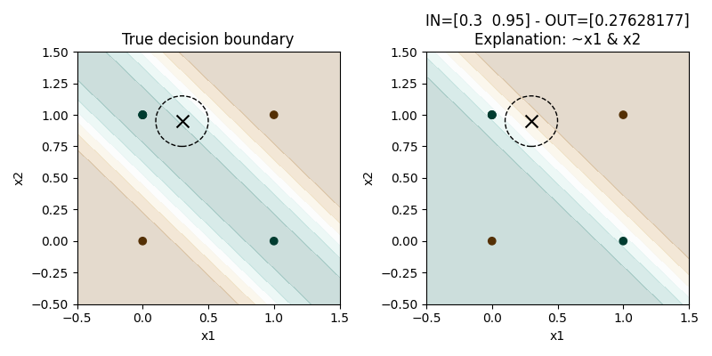

Welcome to Deep Logic
======================

|Build|
|Coverage|

|Docs|
|Dependendencies|

|PyPI license|
|PyPI-version|

.. |Build| image:: https://img.shields.io/travis/pietrobarbiero/deep-logic?label=Master%20Build&style=for-the-badge
    :alt: Travis (.org)
    :target: https://travis-ci.org/pietrobarbiero/deep-logic

.. |Coverage| image:: https://img.shields.io/codecov/c/gh/pietrobarbiero/deep-logic?label=Test%20Coverage&style=for-the-badge
    :alt: Codecov
    :target: https://codecov.io/gh/pietrobarbiero/deep-logic

.. |Docs| image:: https://img.shields.io/readthedocs/deep-logic/latest?style=for-the-badge
    :alt: Read the Docs (version)
    :target: https://deep-logic.readthedocs.io/en/latest/

.. |Dependendencies| image:: https://img.shields.io/requires/github/pietrobarbiero/deep-logic?style=for-the-badge
    :alt: Requires.io
    :target: https://requires.io/github/pietrobarbiero/deep-logic/requirements/?branch=master

.. |Repo size| image:: https://img.shields.io/github/repo-size/pietrobarbiero/deep-logic?style=for-the-badge
    :alt: GitHub repo size
    :target: https://github.com/pietrobarbiero/deep-logic

.. |PyPI download total| image:: https://img.shields.io/pypi/dm/deep-logic?label=downloads&style=for-the-badge
    :alt: PyPI - Downloads
    :target: https://pypi.python.org/pypi/deep-logic/

.. |Open issues| image:: https://img.shields.io/github/issues/pietrobarbiero/deep-logic?style=for-the-badge
    :alt: GitHub issues
    :target: https://github.com/pietrobarbiero/deep-logic

.. |PyPI license| image:: https://img.shields.io/pypi/l/deep-logic.svg?style=for-the-badge
   :target: https://pypi.python.org/pypi/deep-logic/

.. |Followers| image:: https://img.shields.io/github/followers/pietrobarbiero?style=social
    :alt: GitHub followers
    :target: https://github.com/pietrobarbiero/deep-logic

.. |Stars| image:: https://img.shields.io/github/stars/pietrobarbiero/deep-logic?style=social
    :alt: GitHub stars
    :target: https://github.com/pietrobarbiero/deep-logic

.. |PyPI-version| image:: https://img.shields.io/pypi/v/deep-logic?style=for-the-badge
    :alt: PyPI
    :target: https://pypi.python.org/pypi/deep-logic/

.. |Contributors| image:: https://img.shields.io/github/contributors/pietrobarbiero/deep-logic?style=for-the-badge
    :alt: GitHub contributors
    :target: https://github.com/pietrobarbiero/deep-logic

.. |Language| image:: https://img.shields.io/github/languages/top/pietrobarbiero/deep-logic?style=for-the-badge
    :alt: GitHub top language
    :target: https://github.com/pietrobarbiero/deep-logic

.. |Maintenance| image:: https://img.shields.io/maintenance/yes/2019?style=for-the-badge
    :alt: Maintenance
    :target: https://github.com/pietrobarbiero/deep-logic

Deep Logic is a python package providing a set of utilities to
build deep learning models that are explainable by design.

This library provides APIs to get first-order logic explanations from:

* ReLU networks;
* ``psi``-networks, i.e. neural networks with sigmoid activations.

Quick start
-----------

You can install Deep Logic along with all its dependencies from
`PyPI <https://pypi.org/project/deep-logic/>`__:

.. code:: bash

    $ pip install -r requirements.txt deep-logic

Example
-----------

First of all we need to import some useful libraries:

.. code:: python

    import torch
    import numpy as np
    import deep_logic as dl

In most cases it is recommended to fix the random seed for
reproducibility:

.. code:: python

    torch.manual_seed(0)
    np.random.seed(0)

For this simple experiment, let's set up a simple toy problem
as the XOR problem:

.. code:: python

    x_train = torch.tensor([
        [0, 0],
        [0, 1],
        [1, 0],
        [1, 1],
    ], dtype=torch.float)
    y_train = torch.tensor([0, 1, 1, 0], dtype=torch.float).unsqueeze(1)
    xnp = x_train.detach().numpy()
    ynp = y_train.detach().numpy().ravel()

We can instantiate a simple feed-forward neural network with 3 layers:

.. code:: python

    layers = [
        torch.nn.Linear(x_train.size(1), 10),
        torch.nn.ReLU(),
        torch.nn.Linear(10, 4),
        torch.nn.ReLU(),
        torch.nn.Linear(4, 1),
        torch.nn.Sigmoid(),
    ]
    model = torch.nn.Sequential(*layers)

Before training the network, we should validate the input data and the
network architecture. The requirements are the following:

* all the input features should be in ``[0,1]``;
* all the activation functions should be ReLUs.

.. code:: python

    dl.validate_data(x_train)
    dl.validate_network(model, 'relu')

We can now train the network:

.. code:: python

    optimizer = torch.optim.Adam(model.parameters(), lr=0.01)
    model.train()
    for epoch in range(1000):
        # forward pass
        optimizer.zero_grad()
        y_pred = model(x_train)
        # Compute Loss
        loss = torch.nn.functional.mse_loss(y_pred, y_train)

        # L1 regularization
        for module in model.children():
            if isinstance(module, torch.nn.Linear):
                loss += 0.001 * torch.norm(module.weight, 1)

        # backward pass
        loss.backward()
        optimizer.step()

        # compute accuracy
        if epoch % 100 == 0:
            y_pred_d = (y_pred > 0.5)
            accuracy = (y_pred_d.eq(y_train).sum(dim=1) == y_train.size(1)).sum().item() / y_train.size(0)
            print(f'Epoch {epoch}: train accuracy: {accuracy:.4f}')

Once trained we can extract first-order logic formulas describing
local explanations of the prediction for a specific input by looking
at the reduced model:

.. code:: python

    xin = torch.tensor([0.49, 0.95])
    model_reduced = dl.get_reduced_model(model, xin)
    output = model_reduced(xin)
    explanation = fol.generate_local_explanations(model_reduced, xin)
    print(explanation)

The local explanation will be a given in terms of conjunctions
of input features which are locally relevant.
For this specific input, the explanation would be
``~f0 AND f1``.

We can also compare the decision boundaries of the full model wrt
the reduced model to check that they are `locally` similar:

.. code:: python

    plt.figure(figsize=[8, 4])
    plt.subplot(121)
    plt.title('True decision boundary')
    plot_decision_bundaries(model, x_train, h=0.01)
    plt.scatter(xin[0], xin[1], c='k', marker='x', s=100)
    c = plt.Circle((xin[0], xin[1]), radius=0.2, edgecolor='k', fill=False, linestyle='--')
    plt.gca().add_artist(c)
    plt.scatter(xnp[:, 0], xnp[:, 1], c=ynp, cmap='BrBG')
    plt.xlim([-0.5, 1.5])
    plt.ylim([-0.5, 1.5])
    plt.subplot(122)
    plt.title(f'IN={xin.detach().numpy()} - OUT={output.detach().numpy()}\nExplanation: {explanation}')
    plot_decision_bundaries(model_reduced, x_train)
    plt.scatter(xin[0], xin[1], c='k', marker='x', s=100)
    c = plt.Circle((xin[0], xin[1]), radius=0.2, edgecolor='k', fill=False, linestyle='--')
    plt.gca().add_artist(c)
    plt.scatter(xnp[:, 0], xnp[:, 1], c=ynp, cmap='BrBG')
    plt.xlim([-0.5, 1.5])
    plt.ylim([-0.5, 1.5])
    plt.savefig('decision_boundaries.png')
    plt.show()

Finally the ``fol`` package can be used to generate global
explanations of the predictions for a specific class:

.. code:: python

    global_explanation = fol.combine_local_explanations(model, x_train, y_train)
    simplified_explanation = simplify_logic(global_explanation, 'dnf')

The global explanation is given as a disjunction of local explanations
for a specified class.
For this problem the generated explanation for class ``y=1`` is
``(f1 AND ~f2) OR (f2  AND ~f1)``
which corresponds to ``f1 XOR f2``
(i.e. the `exclusive OR` function).

Theory
--------
Theoretical foundations can be found in the following papers.

Learning of constraints::

    @inproceedings{ciravegna2020constraint,
      title={A Constraint-Based Approach to Learning and Explanation.},
      author={Ciravegna, Gabriele and Giannini, Francesco and Melacci, Stefano and Maggini, Marco and Gori, Marco},
      booktitle={AAAI},
      pages={3658--3665},
      year={2020}
    }

Learning with constraints::

    @inproceedings{marra2019lyrics,
      title={LYRICS: A General Interface Layer to Integrate Logic Inference and Deep Learning},
      author={Marra, Giuseppe and Giannini, Francesco and Diligenti, Michelangelo and Gori, Marco},
      booktitle={Joint European Conference on Machine Learning and Knowledge Discovery in Databases},
      pages={283--298},
      year={2019},
      organization={Springer}
    }

Constraints theory in machine learning::

    @book{gori2017machine,
      title={Machine Learning: A constraint-based approach},
      author={Gori, Marco},
      year={2017},
      publisher={Morgan Kaufmann}
    }

Authors
-------

* `Pietro Barbiero <http://www.pietrobarbiero.eu/>`__, University ofCambridge, UK.
* Francesco Giannini, University of Florence, IT.
* Gabriele Ciravegna, University of Florence, IT.
* Dobrik Georgiev, University of Cambridge, UK.

Licence
-------

Copyright 2020 Pietro Barbiero, Francesco Giannini, Gabriele Ciravegna, and Dobrik Georgiev.

Licensed under the Apache License, Version 2.0 (the "License"); you may
not use this file except in compliance with the License. You may obtain
a copy of the License at: http://www.apache.org/licenses/LICENSE-2.0.

Unless required by applicable law or agreed to in writing, software
distributed under the License is distributed on an "AS IS" BASIS,
WITHOUT WARRANTIES OR CONDITIONS OF ANY KIND, either express or implied.

See the License for the specific language governing permissions and
limitations under the License.