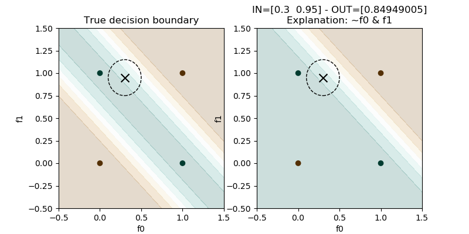

FOL explanations of ReLU-networks
=======================================

First of all we need to import some useful libraries:

.. code:: python

    import torch
    import numpy as np
    import deep_logic as dl

In most cases it is recommended to fix the random seed for
reproducibility:

.. code:: python

    torch.manual_seed(0)
    np.random.seed(0)

For this simple experiment, let's set up a simple toy problem
as the XOR problem:

.. code:: python

    x_train = torch.tensor([
        [0, 0],
        [0, 1],
        [1, 0],
        [1, 1],
    ], dtype=torch.float)
    y_train = torch.tensor([0, 1, 1, 0], dtype=torch.float).unsqueeze(1)
    xnp = x_train.detach().numpy()
    ynp = y_train.detach().numpy().ravel()

We can instantiate a simple feed-forward neural network with 3 layers:

.. code:: python

    layers = [
        torch.nn.Linear(x_train.size(1), 10),
        torch.nn.ReLU(),
        torch.nn.Linear(10, 4),
        torch.nn.ReLU(),
        torch.nn.Linear(4, 1),
        torch.nn.Sigmoid(),
    ]
    model = torch.nn.Sequential(*layers)

Before training the network, we should validate the input data and the
network architecture. The requirements are the following:

* all the input features should be in :math:`[0,1]`;
* all the activation functions should be ReLUs.

.. code:: python

    dl.validate_data(x_train)
    dl.validate_network(model, 'relu')

We can now train the network:

.. code:: python

    optimizer = torch.optim.Adam(model.parameters(), lr=0.01)
    model.train()
    for epoch in range(1000):
        # forward pass
        optimizer.zero_grad()
        y_pred = model(x_train)
        # Compute Loss
        loss = torch.nn.functional.mse_loss(y_pred, y_train)

        # L1 regularization
        for module in model.children():
            if isinstance(module, torch.nn.Linear):
                loss += 0.001 * torch.norm(module.weight, 1)

        # backward pass
        loss.backward()
        optimizer.step()

        # compute accuracy
        if epoch % 100 == 0:
            y_pred_d = (y_pred > 0.5)
            accuracy = (y_pred_d.eq(y_train).sum(dim=1) == y_train.size(1)).sum().item() / y_train.size(0)
            print(f'Epoch {epoch}: train accuracy: {accuracy:.4f}')

Once trained we can extract first-order logic formulas describing
local explanations of the prediction for a specific input by looking
at the reduced model:

.. code:: python

    xin = torch.tensor([0.49, 0.95])
    model_reduced = dl.get_reduced_model(model, xin)
    output = model_reduced(xin)
    explanation = fol.generate_local_explanations(model_reduced, xin)
    print(explanation)

The local explanation will be a given in terms of conjunctions
of input features which are locally relevant.
For this specific input, the explanation would be
:math:`\neg f_0 \land f_1`.

We can also compare the decision boundaries of the full model wrt
the reduced model to check that they are `locally` similar:

.. code:: python

    plt.figure(figsize=[8, 4])
    plt.subplot(121)
    plt.title('True decision boundary')
    plot_decision_bundaries(model, x_train, h=0.01)
    plt.scatter(xin[0], xin[1], c='k', marker='x', s=100)
    c = plt.Circle((xin[0], xin[1]), radius=0.2, edgecolor='k', fill=False, linestyle='--')
    plt.gca().add_artist(c)
    plt.scatter(xnp[:, 0], xnp[:, 1], c=ynp, cmap='BrBG')
    plt.xlim([-0.5, 1.5])
    plt.ylim([-0.5, 1.5])
    plt.subplot(122)
    plt.title(f'IN={xin.detach().numpy()} - OUT={output.detach().numpy()}\nExplanation: {explanation}')
    plot_decision_bundaries(model_reduced, x_train)
    plt.scatter(xin[0], xin[1], c='k', marker='x', s=100)
    c = plt.Circle((xin[0], xin[1]), radius=0.2, edgecolor='k', fill=False, linestyle='--')
    plt.gca().add_artist(c)
    plt.scatter(xnp[:, 0], xnp[:, 1], c=ynp, cmap='BrBG')
    plt.xlim([-0.5, 1.5])
    plt.ylim([-0.5, 1.5])
    plt.savefig('decision_boundaries.png')
    plt.show()

Finally the ``fol`` package can be used to generate global
explanations of the predictions for a specific class:

.. code:: python

    global_explanation = fol.combine_local_explanations(model, x_train, y_train)
    simplified_explanation = simplify_logic(global_explanation, 'dnf')

The global explanation is given as a disjunction of local explanations
for a specified class.
For this problem the generated explanation for class :math:`y=1` is
:math:`(f_1 \land \neg f_2) \lor (f_2  \land \neg f_1)`
which corresponds to :math:`f_1 \oplus f_2`
(i.e. the exclusive OR function).